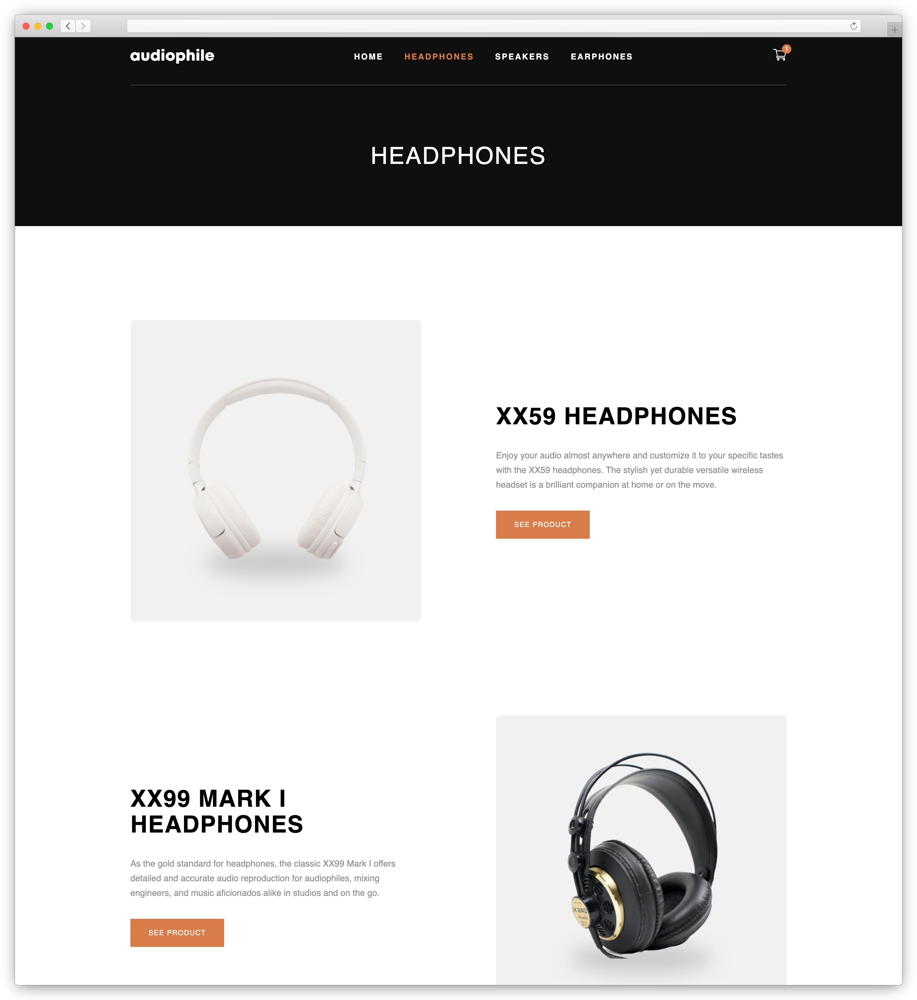
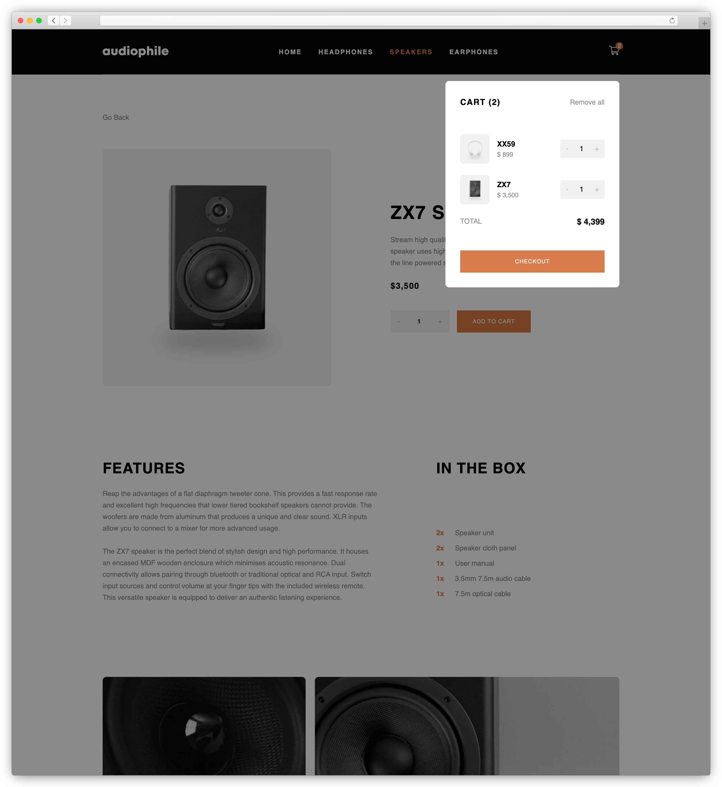
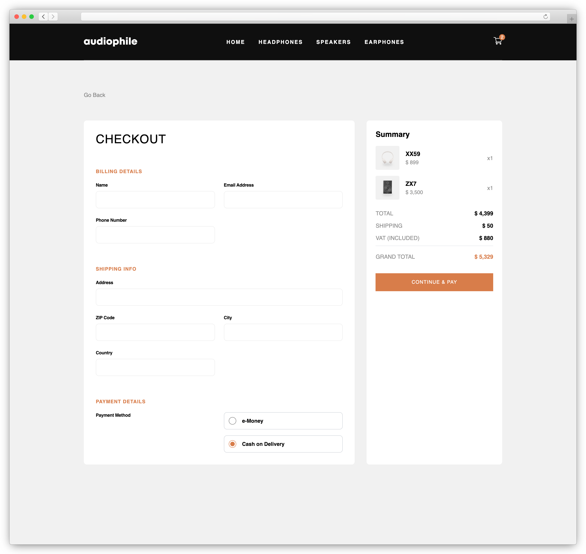

# Audiophile E-commerce

Audiophile E-commerce is a frontend-focused e-commerce project built with React and TypeScript, utilizing Supabase as a Backend-as-a-Service solution. The project demonstrates modern frontend development practices, including responsive design, state management, and form handling, while leveraging Supabase for data storage and retrieval.
App is built with React, TypeScript, TailwindCSS, React Router, React Hook Form, Vite, Supabase.

## Demo & Screenshots

### Application Overview


### Key Features

#### Homepage


_Modern and responsive homepage with category navigation_

#### Category page


_Category view with products_

#### Product details and shopping Cart


_Product details and shopping cart_

#### Checkout Process


_Checkout page with form validation_

## Live Version

The application is available online at: https://audiophile-ecommerce-front-end.vercel.app/

## Technologies Used

- **React 18**: JavaScript library for building user interfaces
- **TypeScript**: Typed superset of JavaScript
- **TailwindCSS**: CSS framework for rapid custom designs
- **React Router 6**: Routing library for React applications
- **React Hook Form**: Library for efficient form management
- **Supabase**: Backend as a Service for database and API
- **Vite**: Build tool for fast frontend development
- **React Portal**: For modal implementations
- **React Icons**: Icon library

## Key Features

- Responsive design for all devices
- Interactive shopping cart with local storage persistence
- Dynamic product loading with Supabase integration
- Form validation using React Hook Form
- Smooth animations and transitions
- Image optimization for different screen sizes
- Error handling and loading states
- Modal windows using React Portal
- Category-based product navigation

## Installation

1. **Clone the repository:**

   ```sh
   git clone https://github.com/RobertGraupner/Audiophile-Ecommerce.git
   ```

2. **Navigate to the project directory:**

   ```sh
   cd audiophile-ecommerce
   ```

3. **Install the dependencies:**

   ```sh
   npm install
   ```

4. **Start the development server:**
   ```sh
   npm run dev
   ```

## Usage

Access the application at `http://localhost:5173`. The app allows you to:

- Browse for audio products
- View detailed product information
- Add items to cart
- Manage shopping cart (add, remove, adjust quantities)
- Complete checkout process
- Responsive design for various screen sizes
